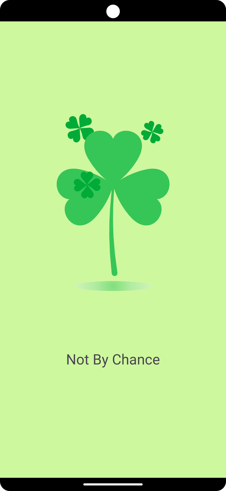
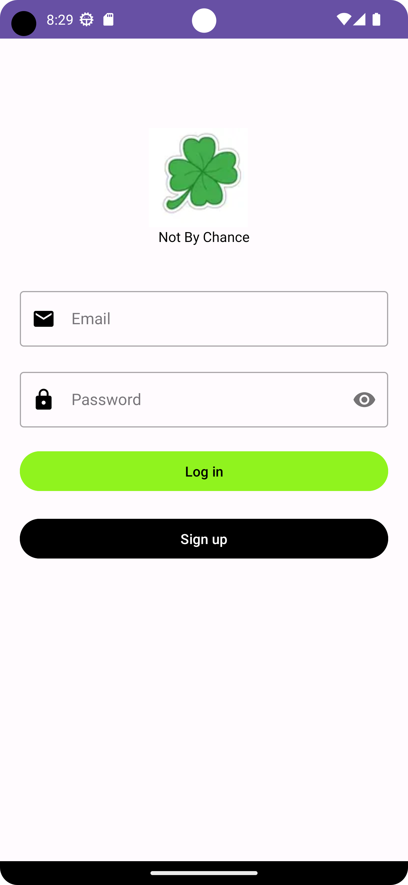
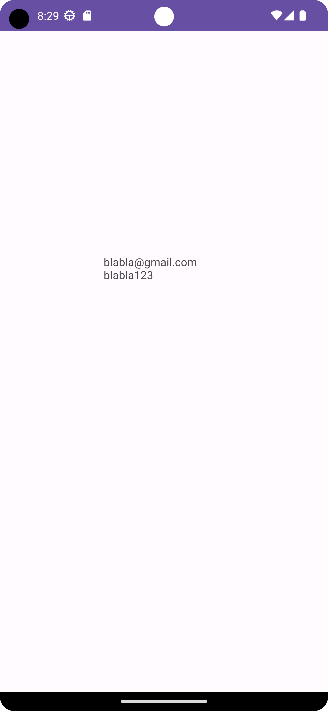

# Animation Example

In this project, we aimed to make motion animation using Lottie, to create an animation file to make the transition between activities smoother, to send information between activities with intent, and to use TextInputLayout.
It consists of three main activities.
- Main Activity (Splash Screen)
- Login Activity
- Dashboard Activity   

### Splash Screen
- The application starts with Splash Screen. Here we created motion animation with Lottie. For this, we added dependency in the build.gradle file.
- Apart from that, we created the animation file that we created under the res for the slogan name.   

   

### Login 
- When this activity fills the time we set, it automatically goes to the Login page.
- Here, we ask the user to simply type his e-mail and password. We do not keep this information in any database or check whether the information exists in the database.
- We also tried to provide a smoother transition between splash screen and Login by specifying transition name in XML.  

   
 
 ### Dashboard
 - Finally, there is the Dashboard activity. There is nothing in terms of design on this screen. The goal is to get the data from the Login activity with intent and print it inside a TextView.
  

